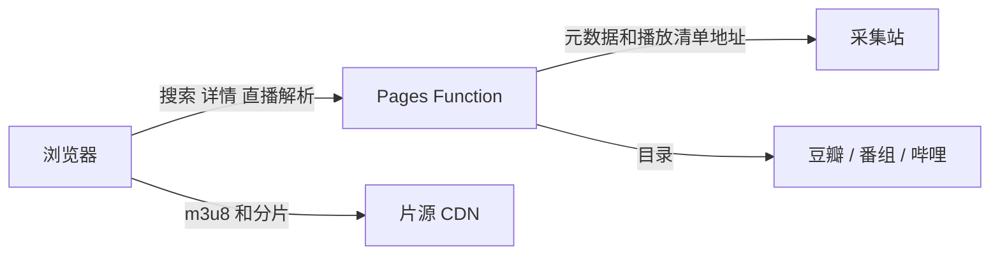

# CKTV


影视聚合播放器。目录、搜索和直播解析走 Cloudflare Pages，正片分片由浏览器直接向片源 CDN 请求。普通片、直播、18+、AI 黄果分栏，成人源不进入全站搜索。

[](https://nextjs.org/)
[](https://developers.cloudflare.com/pages/)
[](https://pages.cloudflare.com/)
[](https://github.com/video-dev/hls.js/)

在线：[tv.chuankangkk.top](https://tv.chuankangkk.top) · 预览：[ck-tv.pages.dev](https://ck-tv.pages.dev) · 仓库：[1837620622/ck_tv](https://github.com/1837620622/ck_tv)

## 赞助

CKTV 由个人维护。域名、Pages 和接口巡检没有团队。用得顺手，希望能赞助这个项目，金额随意。不赞助也可以正常观看。

<table>
  <tr>
    <td width="70%">
      <p>赞助用来续域名，以及继续改播放、缓存和直播线路。</p>
      <ul>
        <li>微信：1837620622（传康Kk）</li>
        <li>邮箱：2040168455@qq.com</li>
        <li>咸鱼 / B站：万能程序员</li>
      </ul>
    </td>
    <td>
      
    </td>
  </tr>
</table>

## 技术栈

| 层       | 选择                                                |
| -------- | --------------------------------------------------- |
| 界面     | Next.js 14 App Router，React 18，Tailwind CSS       |
| 接口     | `src/app/api/*`，`export const runtime = 'edge'`    |
| 托管     | Cloudflare Pages，`@cloudflare/next-on-pages`       |
| 点播     | ArtPlayer，HLS 由 hls.js 或浏览器原生播放           |
| 直播     | hls.js，固定清单优先，失败再向央视网页接口要新地址  |
| 片源     | `config.json` 里的 Apple CMS，`api.php/provide/vod` |
| 本机数据 | `localStorage`：收藏、进度、跳过片头片尾、代理开关  |
| 包管理   | pnpm                                                |

## 请求怎么走



Pages 只经手清单、海报和目录 JSON。`.ts` 分片不进本站，也不在边缘转发。

1. 首页目录来自豆瓣、番组计划或哔哩排行。哔哩排行返回 412 时，目录改用豆瓣条目。点开卡片后按片名到普通片源里检索，不使用哔哩播放地址。
2. 全站搜索只请求 `api_site`。每个源只取第一页，避免翻页把无关条目带进来。
3. 详情返回分集 m3u8。浏览器拉清单，再按清单向片源 CDN 要分片。Safari 可走原生 HLS，其他浏览器走 hls.js。
4. 换源测速只读播放清单：从 `RESOLUTION` 取清晰度，记录一次往返。失败就是失败，不编造速度。源的先后按 `config.json` 的优先级，不按测速毫秒重排。已经出画的线路不自动换掉。
5. 直播先播写死的 HTTPS 清单。这条失败，再请求 `/api/live?id=&fresh=1` 向央视网页接口要新地址。出画才算成功，只解析到清单不算。播放地址 `Cache-Control: no-store`。
6. CCTV-1、CCTV-13 使用实际为 720 的 `td` 媒体清单。主清单把 `pd` 标成 1080，分片实测是 360，所以不走那一档，也不按主清单的码率标签去锁最高档。

## 缓存

Pages Function 的响应默认是动态的，`Cache-Control` 不会自动进边缘。聚合 JSON 由代码写入 Cache API，并用 `cf.cacheTtl` 控制回源。

| 数据                         | 处理                           |
| ---------------------------- | ------------------------------ |
| 有内容的目录、搜索、成人列表 | 写入边缘缓存                   |
| 空列表                       | `no-store`，不写入             |
| 直播解析                     | `no-store`，`cf.cacheTtl = 0`  |
| 黄果封面解密结果             | 解密成功后缓存，只接受指定图床 |
| 视频分片                     | 不缓存，不代理                 |

不设置自定义 `cacheKey`。

## 栏目隔离

| 栏目               | 路径                  | 数据                                                                                        |
| ------------------ | --------------------- | ------------------------------------------------------------------------------------------- |
| 首页 / 搜索 / 点播 | `/` `/search` `/play` | 只使用 `api_site`                                                                           |
| 豆瓣 / 番组 / 哔哩 | `/douban`             | 目录在上游，播放仍回普通片源                                                                |
| 直播               | `/live`               | 公开 HTTPS 清单，或现取的央视地址。抖音、快手、哔哩直播、斗鱼、虎牙、央视频、闲鱼只打开官网 |
| 18+                | `/adult`              | 只使用 `adult_api_site`，不参与全站搜索                                                     |
| AI 黄果            | `/huangguo`           | 独立接口。封面经 `/api/huangguo/cover` 解密后显示，密钥不返回浏览器                         |

18+ 和 AI 黄果共用年龄确认。确认结果只放在当前会话的 `sessionStorage`。未确认时看不到列表。

## 目录

```text
src/app            页面和 Edge 接口
src/components     界面
src/lib            片源、搜索、缓存、直播、黄果
config.json        普通源和成人源
scripts            生成 runtime、manifest、版本号
public             图标和赞赏码
```

`pnpm gen:runtime` 把 `config.json` 写成 `src/lib/runtime.ts`。这个文件不提交。提交前的钩子会重写版本号，不要手改 `src/lib/version.ts` 和 `VERSION.txt`。

## 本地

```bash
pnpm install
pnpm dev
```

开发地址是 `http://127.0.0.1:3000`。`pnpm dev` 会先生成 runtime 和 manifest，再启动 Next.js。

```bash
pnpm lint:strict
pnpm typecheck
```

## 部署

Cloudflare Pages 项目 `ck-tv`。生产域名 `tv.chuankangkk.top`，同时保留 `ck-tv.pages.dev`。

构建命令：

```bash
pnpm install --frozen-lockfile && pnpm run pages:build
```

`pages:build` 依次执行 `gen:runtime`、`gen:manifest`、`next build`、`@cloudflare/next-on-pages`。输出目录是 `.vercel/output/static`。

没有管理后台。`/admin` 返回 404。收藏和设置留在浏览器本地。

## 边界

- 不代理 HLS 分片，不在服务端预下载正片来测速。
- 不把 `adult_api_site` 并进全站搜索。
- 不缓存空列表和直播播放地址。
- 不按测速结果打乱 `config.json` 里的源顺序。
- 直播不写入会过期的签名地址，也不接入需要逆向客户端的房间流。

## 免责声明

普通栏目的片源来自公开接口，仅供学习与技术交流。本站不存储、不制作视频。

18+ 和 AI 黄果只给年满 18 周岁的访客。站长不制作、不存储、不传播这些影片，只是把第三方公开接口接到播放器里，优化站点的浏览和播放。视频在对方服务器，本站不留副本。

未满 18 周岁不要进入。进入之后的观看由访客自己负责。权利人认为某个链接不该出现，发邮件到 2040168455@qq.com，核实后去掉。

进入这两个栏目前会看到同样的声明，口令写在声明下面。
